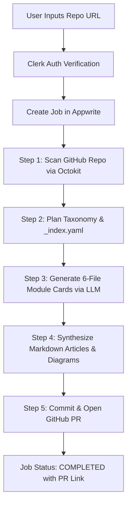

# 🌸 Code Saaya (Saaya Repowiki Generator)

**Code Saaya** is an AI-powered automated repository documentation and wiki generator. It scans your GitHub codebase, analyzes project taxonomy, generates structured multi-file knowledge cards for each module, synthesizes comprehensive Markdown articles with diagrams, and automatically submits a Pull Request containing `.saaya/repowiki/` directly to your repository.

---

## ✨ Features

- 🚀 **5-Step Automated AI Pipeline**:
  1. **Repository Scanning**: Analyzes codebase structures, file trees, and project metadata using Octokit.
  2. **Taxonomy & Indexing**: Generates `_index.yaml` and maps module dependency graphs.
  3. **Module Card Generation**: Produces 6-file structured knowledge cards per software module.
  4. **Article Synthesis**: Synthesizes rich, cross-linked Markdown documentation with visual diagrams.
  5. **Automated PR Creation**: Automatically creates and opens a GitHub Pull Request with the generated wiki.
- 🔐 **Clerk Authentication**: Secure user management and seamless OAuth authentication.
- 🗄️ **Appwrite Persistence**: Real-time job status tracking, user provider configuration, and artifact history.
- 🤖 **Flexible LLM Provider Support**:
  - **OpenRouter OAuth & API Key**: Direct integration with top models (Claude 3.5, GPT-4o, DeepSeek R1, Llama 3.3).
  - **Custom OpenAI-Compatible Endpoints**: Connect to local models (Ollama, vLLM, LMStudio) or cloud endpoints (Together.ai, Groq).
  - **Granular Rate Control**: Customizable Max RPM, Max TPM, and parallel agent concurrency limits.
- 🎨 **Modern Japanese-Inspired Aesthetic UI**: Built with Next.js 16 App Router, React 19, Tailwind CSS v4, Framer Motion, and GSAP.

---

## 🛠️ Technology Stack

| Layer | Technology |
| :--- | :--- |
| **Framework** | [Next.js 16 (App Router)](https://nextjs.org/) & React 19 |
| **Language** | TypeScript |
| **Styling & UI** | Tailwind CSS v4, Framer Motion, GSAP, Lucide Icons |
| **Authentication** | [Clerk](https://clerk.com/) (`@clerk/nextjs`) |
| **Database & Backend** | [Appwrite](https://appwrite.io/) (`node-appwrite`) |
| **AI Orchestration** | LangChain (`@langchain/core`, `@langchain/langgraph`, `@langchain/openai`), OpenAI SDK |
| **GitHub Integration** | `@octokit/rest` |
| **Deployment** | [Vercel](https://vercel.com/) |

---

## 🏗️ Architecture & Pipeline Overview



---

## 🚀 Getting Started

### Prerequisites

- **Node.js**: `v20.9.0` or higher
- **npm** / **pnpm** / **yarn**
- **Clerk Account**: For authentication keys
- **Appwrite Instance**: Cloud or self-hosted project

### 1. Clone the Repository

```bash
git clone https://github.com/anurag3407/code-saaya.git
cd code-saaya
```

### 2. Install Dependencies

```bash
npm install
```

### 3. Configure Environment Variables

Create a `.env.local` file in the root directory:

```env
# Application URL
NEXT_PUBLIC_APP_URL=http://localhost:3000

# Clerk Authentication
NEXT_PUBLIC_CLERK_PUBLISHABLE_KEY=pk_test_...
CLERK_SECRET_KEY=sk_test_...
NEXT_PUBLIC_CLERK_SIGN_IN_URL=/sign-in
NEXT_PUBLIC_CLERK_SIGN_UP_URL=/sign-up

# Appwrite Database
NEXT_PUBLIC_APPWRITE_ENDPOINT=https://cloud.appwrite.io/v1
NEXT_PUBLIC_APPWRITE_PROJECT_ID=your_project_id
APPWRITE_API_KEY=your_admin_api_key
APPWRITE_DATABASE_ID=saaya_db

# OpenRouter Integration
OPENROUTER_AUTH_URL=https://openrouter.ai/auth
OPENROUTER_API_URL=https://openrouter.ai/api/v1
OPENROUTER_API_KEY=sk-or-v1-... # Optional default fallback

# GitHub Access Token (for PR creation)
GITHUB_TOKEN=ghp_...
```

### 4. Run Development Server

```bash
npm run dev
```

Open [http://localhost:3000](http://localhost:3000) in your browser to start using Code Saaya.

---

## ⚡ Deployment on Vercel

The easiest way to deploy Code Saaya is via [Vercel](https://vercel.com):

1. Push your repository to GitHub.
2. Import the project in Vercel.
3. Configure your **Environment Variables** in Vercel Project Settings:
   - `NEXT_PUBLIC_APP_URL=https://your-domain.vercel.app`
   - Add your Clerk, Appwrite, and OpenRouter API credentials.
4. Click **Deploy**.

---

## 📜 License

This project is open-source under the [MIT License](LICENSE).
